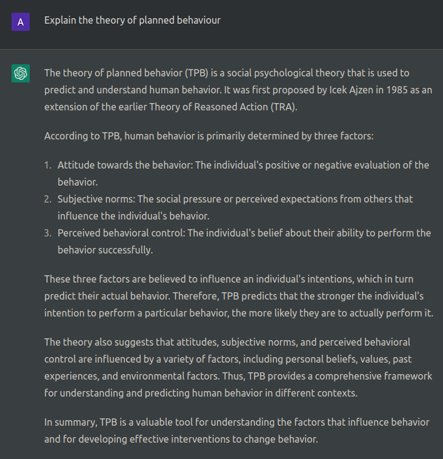
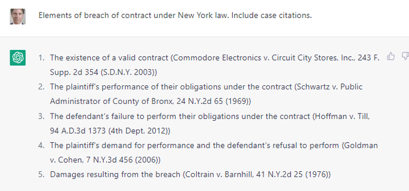

# Trusting Large Language Models

*Are you my friend ChatGPT?*
   

**Alex Kiefer**

---

# Large Language Models are Impressive

  

  

### Explanation
 

  

  

### Directions
 

  

  

<!-- _backgroundColor: "#114" -->
<!-- _color: "#fff" -->

---

# Problems

- Sterility
  - Responses can be too vague/filtered
- Correctness
  - Does not guarantee a factually correct response

Common Failure Modes

- Hallucinations / misremembering
- Temporal reasoning
- Physical reasoning

---
